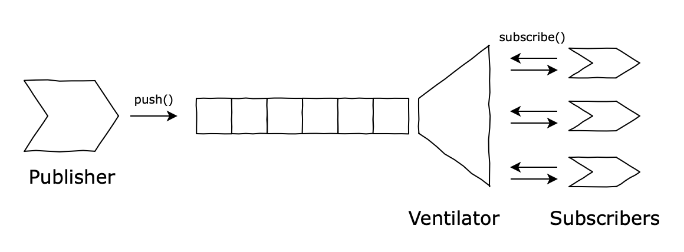
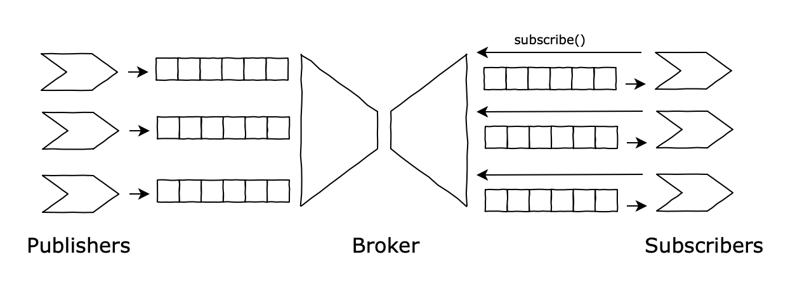
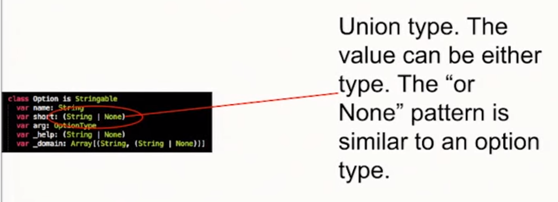
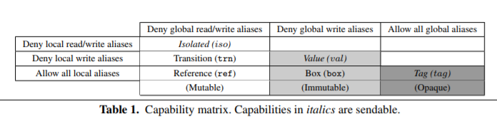

# Publish-Subscriber scenarios using an Actor-Model programming language

We implemented different scenarios (explicited below) using **Pony**. From Pony's [website](https://www.ponylang.io/): *"Pony is an open-source, object-oriented, actor-model, capabilities-secure, high-performance programming language."*

## Scenarios Implemented

### [Scenario 1](https://github.com/antonioalmeida/feup-asso/tree/scenario1)


* Unbounded queue;
* Publisher sends messages a.s.a.p.;
* Subscriber tries to pull messages and blocks (`awaits`) until it has one;
* *Implicit* subscription (fetch directly from data structure).

----

### [Scenario 2](https://github.com/antonioalmeida/feup-asso/tree/scenario2)


* Unbounded queue and publishes asap (again);
* Multiple subscribers:
    * They pull messages concurrently;
    * Each gets a different message;
* *Implicit* subscription (fetch from data structure).

----

### [Scenario 3](https://github.com/antonioalmeida/feup-asso/tree/scenario3)



* Unbounded queue and publishes asap (again);
* *Ventilator* (or Subscription Manager) knows about the subscribers:
    * [Observer](https://en.wikipedia.org/wiki/Observer_pattern) used to push to subscribers (*Explicit* subscription);
    * Different specializations of *ventilators* ([Fanout](https://en.wikipedia.org/wiki/Fan-out_(software)), Round-robin...).

#### With steroids:

* Understands receipt notification (**ACK**) from subscribers;
* May use [Heart Beat](https://en.wikipedia.org/wiki/Heartbeat_(computing)), [Timeout](https://en.wikipedia.org/wiki/Timeout_(computing)) and [Circuit breaker](https://martinfowler.com/bliki/CircuitBreaker.html) patterns to deal with delivery failures;
* Manages message meta-information, such as marking them as *tentatively consumed*, until it has such guarantees (e.g., to avoids losing messages).

----

### [Scenario 4](https://github.com/antonioalmeida/feup-asso/tree/scenario4)



* Multiple publishers, multiple subscribers;
* Both have specialized queues:
    * Inbound and Outbound;
    * Broker manages queue binding;
    * Broker moves messages around (between queues);
    * Queues may be persistent;
* No implicit connections between subscribers and producers:
    * *Explicit* subscription;
    * Identification mechanism is needed (keys, topics, ...);
    * Study the [Registry](https://martinfowler.com/eaaCatalog/registry.html) and (if you are feeling adventurous) the [Service Locator](https://en.wikipedia.org/wiki/Service_locator_pattern) patterns.

----


## Design Patterns to Consider

| Design Pattern  | Link                                                   |
|-----------------|--------------------------------------------------------|
| Singleton       |  https://sourcemaking.com/design_patterns/singleton    |
| Builder         |  https://sourcemaking.com/design_patterns/builder      |
| Composite       |  https://sourcemaking.com/design_patterns/composite    |
| Flyweight       |  https://sourcemaking.com/design_patterns/flyweight    |
| Command         |  https://sourcemaking.com/design_patterns/command      |
| Iterator        |  https://sourcemaking.com/design_patterns/iterator     |
| Null Object     |  https://sourcemaking.com/design_patterns/null_object  |
| Visitor         |  https://sourcemaking.com/design_patterns/visitor      |
| ...             |  more to come                                          |


### Notes on the Design Patterns

**[Observer](https://en.wikipedia.org/wiki/Actor_model)**: ```For example, an Actor might need to send a message to a recipient Actor from which it later expects to receive a response, but the response will actually be handled by a third Actor component that has been configured to receive and handle the response (for example, a different Actor implementing the Observer pattern). The original Actor could accomplish this by sending a communication that includes the message it wishes to send, along with the address of the third Actor that will handle the response. This third Actor that will handle the response is called the resumption (sometimes also called a continuation or stack frame). When the recipient Actor is ready to send a response, it sends the response message to the resumption Actor address that was included in the original communication.```

**[Option Pattern](https://www.codeproject.com/Articles/17607/The-Option-Pattern)**: 


### Notes on Pony


## Development 

### Setup
Install pony compiler `ponyc`

### Compile
```shell
# compile the package
$ make build/asso 

# compile tests
$ make build/test 
```

### Run

__Note:__ both these commands will compile the source if they're not built.
```shell

# run the package's Main
$ make run

# run tests
$ make test
```

## Iterations 

### v0.0.1

First attempt at Scenario 1 


##### Pros
- "Everything" is asynchronous - no blocking calls
- Making use of the Actor Models and its messaging system on our advantage - through Pony's behaviours

#### Cons
- EVERYTHING is asynchronous - the change in mindset still hasn't kicked in, and the code reflects that
- Message ordering when publishing and consuming is not guaranteed - need to change the push/pull pattern and possibly look into [reference capabilities](https://tutorial.ponylang.io/reference-capabilities.html)

### v0.0.2

First attempt at Scenario 2


#### Checklist

- [x] ~~Unbounded queue~~. Queue has a predefined capacity defined on its constructor. 
- [x] Publishes asap (again). Pro: from the publisher's POV, the publish mechanism is asynchronous
- [x] Multiple subscribers:
    - [x] They pull messages concurrently;
    - [x] Each gets a different message;
- [x] *Implicit* subscription (fetch from data structure).

#### Potential problems:

* Possible out-of-memory in queue (again);
* Eager producer (again);
* No guarantees on ~~delivery-order, or~~ load-balancing;
* Potentially *loses* messages if they are consumed asap (?). *Not sure if this is true*
* Potentially *duplicates* messages if they are consumed only after subscriber finishes work (?). *Not sure if this is true*

### v0.0.3

Improvements on Scenario 2

#### Improvements:
* Make better use of the typing system, namely [Type Aliases](https://tutorial.ponylang.io/types/type-aliases.html), to encapsulate and improve semantics on messages;
* Not having a `null` value was weird, we now handle that better. [This](https://patterns.ponylang.io/creation/supply-chain.html) helped
* CI through [CircleCI](https://circleci.com/) with containerized build ~~and test~~ jobs


### v0.0.4 (WIP)

Started Scenario 3

Current problems:
* Consumers ~~not consuming~~ (FIXED)?
* Delivery logic by the ventilator not correct (each message in queue should be distributed to all subscribers)
* Common interface between direct consumers (scenario2) and ventilator. Is this something we want to keep?

Next Steps:

- [] Implement multiple subscription methods (_Strategy_ pattern)
- [] Make Ventilator "subscribe" to the queue, instead of having to call an explicit `consume` behaviour


* Unbounded queue and publishes asap;
* *Ventilator* (or Subscription Manager) knows about the subscribers:
    * [Observer](https://en.wikipedia.org/wiki/Observer_pattern) used to push to subscribers (*Explicit* subscription);
    * Different specializations of *ventilators* ([Fanout](https://en.wikipedia.org/wiki/Fan-out_(software)), Round-robin...).
