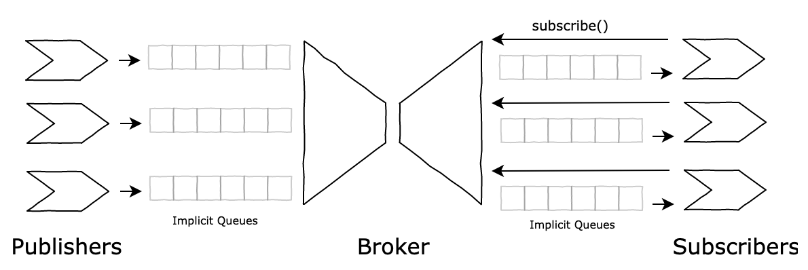

# Scenario 5

After implementing Scenario 4, the extra experience with the language and its nuances led to a couple of *existencial* questions:
* "Are we taking full advantage of the language's purpose/capabilities?";
* "Do we really need an explicit notion of queue?";
    

    
This lead to the design of **Scenario 5**, with the following main goals:
* Remove the notion of queue altogether;
* Instead, make use of Pony's messaging system, namely through Actor behaviours;
* Try to simplify interactions between Actors, given the above changes;

As the [Actor Model](https://www.brianstorti.com/the-actor-model/) defines, Actors communicate among themselves through messages, and for that purpose, each Actor holds their respective mailbox. Specifically in Pony, the messaging system is abstracted through [behaviours](https://tutorial.ponylang.io/types/actors.html), i.e., asynchronous functions/methods, which run sequentially inside a given Actor.

Under the hood, Pony implements an Actor's mailbox through an unbounded FIFO queue - which makes perfect sense, so we believed the next step was to make use of this proven implementation, instead of "reinventing the wheel".

## Results
 * An explicit implementation of a queue no longer exists, yet paralellism/non-eagerness remains;
 * Instead, use of Pony's messaging system on our behalf, namely through Actor behaviours;
 * Behavior calls between Actors, i.e., messages, became simpler needed less;
 * Code base became smaller, while keeping same functionality/interface;

## "Changelog"

## v1.1.0.0

 * Started Scenario 5, based on Scenario 4;
 * Removed the notion of queue altogether;
 * Instead, make use of Pony's messaging system, namely through Actor behaviours.

## v1.1.0.1

 * Simplify interactions between Actors (Publishers, Consumers, Broker);
 * Add some documentation.
