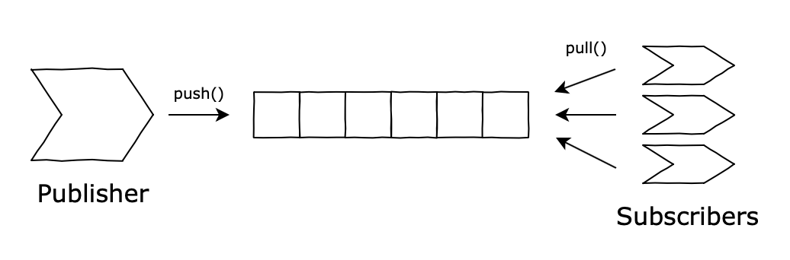

# pony-pubsub

Implementation of different Publish-Subscribe scenarios (explicited below) in [Pony](https://www.ponylang.io/). The main goals of this project were:

* Infer patters on how to design PubSub systems on an Actor Model language;
* Assess how differently (if at all) traditional OOP design patterns still apply on Pony's paradigm;
* Evaluate Pony's core features (*capabilities-secure, actor-model*) help/hinger on solving the PubSub problem;
* Evaluate Pony's as a production-level prgramming language, from various perspectives, e.g., learning curve, community, documentation, stability, etc;

## Scenarios Implemented

### [Scenario 1](https://github.com/antonioalmeida/feup-asso/tree/scenario1)


* Unbounded queue;
* Publisher sends messages a.s.a.p.;
* Subscriber tries to pull messages and blocks (`awaits`) until it has one;
* *Implicit* subscription (fetch directly from data structure).

----

### [Scenario 2](https://github.com/antonioalmeida/feup-asso/tree/scenario2)



* Unbounded queue and publishes asap (again);
* Multiple subscribers:
    * They pull messages concurrently;
    * Each gets a different message;
* *Implicit* subscription (fetch from data structure).

----

### [Scenario 3](https://github.com/antonioalmeida/feup-asso/tree/scenario3)


* Unbounded queue and publishes asap (again);
* *Ventilator* (or Subscription Manager) knows about the subscribers:
    * [Observer](https://en.wikipedia.org/wiki/Observer_pattern) used to push to subscribers (*Explicit* subscription);
    * Different specializations of *ventilators* ([Fanout](https://en.wikipedia.org/wiki/Fan-out_(software)), Round-robin...).
    
----

### [Scenario 4](https://github.com/antonioalmeida/feup-asso/tree/scenario4)


* Multiple publishers, multiple subscribers;
* Both have specialized queues:
    * Inbound and Outbound;
    * Broker manages queue binding;
    * Broker moves messages around (between queues);
    * Queues may be persistent;
* No implicit connections between subscribers and producers:
    * *Explicit* subscription;
    * Identification mechanism is needed (keys, topics, ...);
    * Study the [Registry](https://martinfowler.com/eaaCatalog/registry.html) and (if you are feeling adventurous) the [Service Locator](https://en.wikipedia.org/wiki/Service_locator_pattern) patterns.

----

### [Scenario 5](https://github.com/antonioalmeida/feup-asso/tree/scenario5)


    
* Remove the notion of queue altogether;
* Instead, make use of Pony's messaging system, namely through Actor behaviours;

## Design Patterns to Consider

| Design Pattern  | Link                                                   |
|-----------------|--------------------------------------------------------|
| Singleton       |  https://sourcemaking.com/design_patterns/singleton    |
| Builder         |  https://sourcemaking.com/design_patterns/builder      |
| Composite       |  https://sourcemaking.com/design_patterns/composite    |
| Flyweight       |  https://sourcemaking.com/design_patterns/flyweight    |
| Command         |  https://sourcemaking.com/design_patterns/command      |
| Iterator        |  https://sourcemaking.com/design_patterns/iterator     |
| Null Object     |  https://sourcemaking.com/design_patterns/null_object  |
| Visitor         |  https://sourcemaking.com/design_patterns/visitor      |
| ...             |  more to come                                          |


### Notes on the Design Patterns

**[Observer](https://en.wikipedia.org/wiki/Actor_model)**: ```For example, an Actor might need to send a message to a recipient Actor from which it later expects to receive a response, but the response will actually be handled by a third Actor component that has been configured to receive and handle the response (for example, a different Actor implementing the Observer pattern). The original Actor could accomplish this by sending a communication that includes the message it wishes to send, along with the address of the third Actor that will handle the response. This third Actor that will handle the response is called the resumption (sometimes also called a continuation or stack frame). When the recipient Actor is ready to send a response, it sends the response message to the resumption Actor address that was included in the original communication.```

**[Option Pattern](https://www.codeproject.com/Articles/17607/The-Option-Pattern)**: 


### Notes on Pony


## Development 

### Setup
Install pony compiler `ponyc`

### Compile
```shell
# compile the package
$ make build/asso 

# compile tests
$ make build/test 
```

### Run

__Note:__ both these commands will compile the source if they're not built.
```shell

# run the package's Main
$ make run

# run tests
$ make test
```
